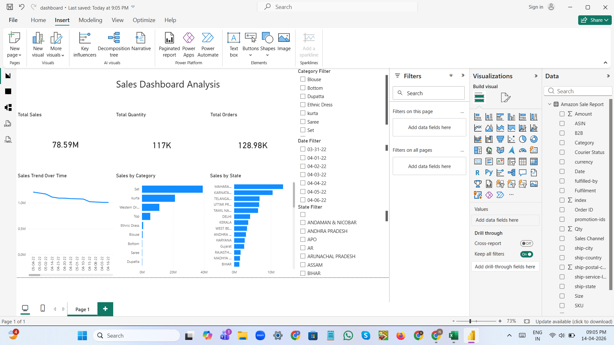

# 📊 Task-4: Sales Dashboard Design

## 📌 Project Overview
This project presents a **Power BI Sales Dashboard** built using Amazon sales data.  
The goal is to analyze sales performance, identify trends, and provide interactive insights.

---

## 📁 Dataset
- Source: Amazon Sales Report  
- Cleaned dataset used (sample of original data)  
- File: `Amazon_Sales_Sample.csv`

---

## 📊 Dashboard Features

### 🔹 Key Metrics (KPIs)
- Total Sales  
- Total Quantity  
- Total Orders  

### 🔹 Visualizations
- Sales Trend Over Time (Line Chart)  
- Sales by Category (Bar Chart)  
- Sales by State (Bar Chart)  

### 🔹 Filters (Slicers)
- Category Filter  
- Date Filter  
- State Filter  

---

## 🛠 Tools Used
- Power BI  
- Microsoft Excel  
- GitHub  

---

## 📸 Dashboard Preview

---

## 📂 Files Included
- `dashboard.pbix` → Power BI file  
- `dashboard.png` → Dashboard image  
- `SalesDashboard.pptx` → Project presentation  
- `Amazon_Sales_Sample.csv` → Dataset  

---

## 🚀 Conclusion
This dashboard helps in understanding sales patterns, identifying top-performing categories, and analyzing regional performance using interactive filters.

---
